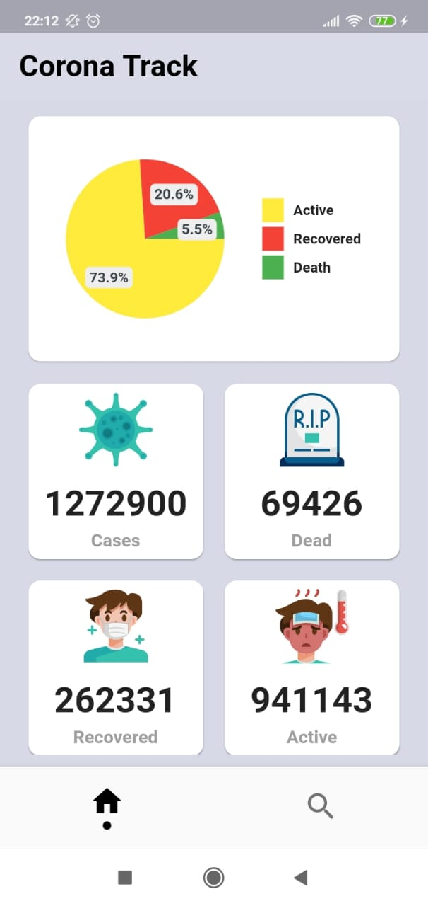
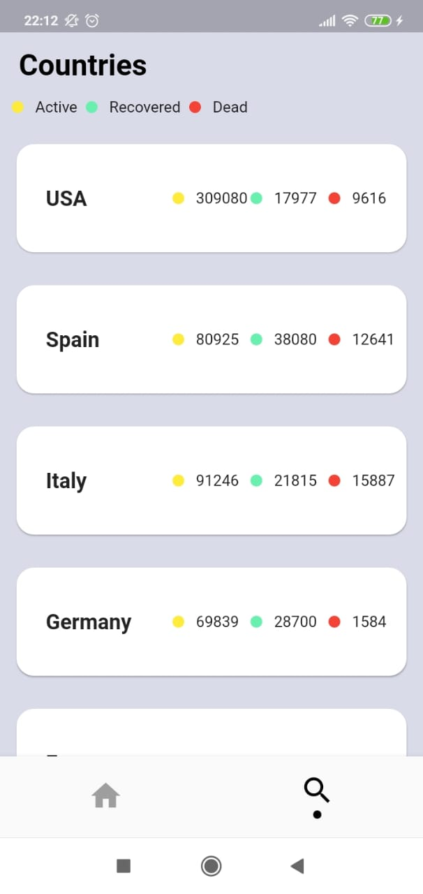
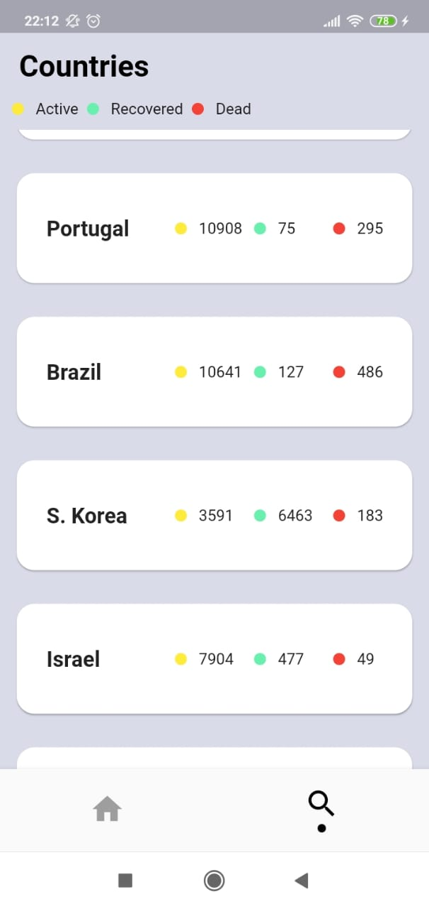

# covid_tracker_app
A Covid19 app that shows all statistics about it.
Screenshots
 

## Getting Started
It searches for the latest data on cases of corona viruses from around the world and displays them in a simple and easy to understand interface.

Source of Data
Special thanks to Novel Covid API for providing free APIs to fetch data.
https://corona.lmao.ninja/

layout based on
https://dribbble.com/shots/10821409-Corona-Cases-Tracker-App/

## Getting Started

This project is a starting point for a Flutter application.

A few resources to get you started if this is your first Flutter project:

- [Lab: Write your first Flutter app](https://flutter.dev/docs/get-started/codelab)
- [Cookbook: Useful Flutter samples](https://flutter.dev/docs/cookbook)

For help getting started with Flutter, view our
[online documentation](https://flutter.dev/docs), which offers tutorials,
samples, guidance on mobile development, and a full API reference.
